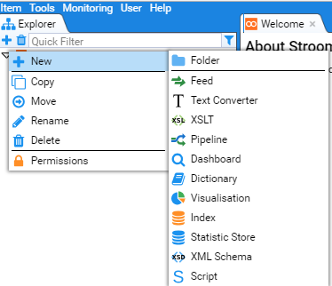
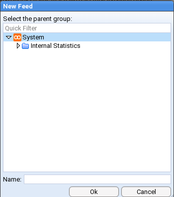
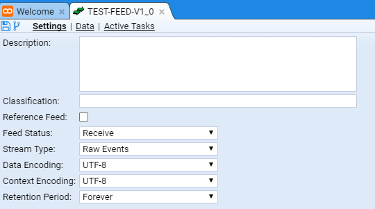
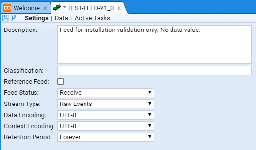
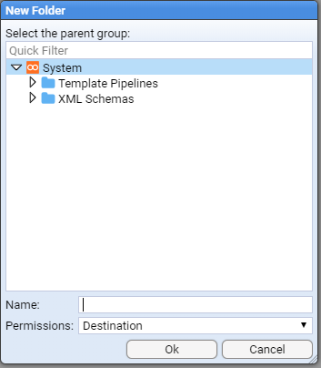
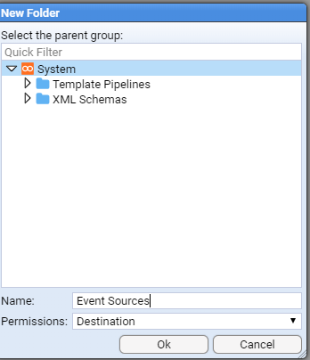
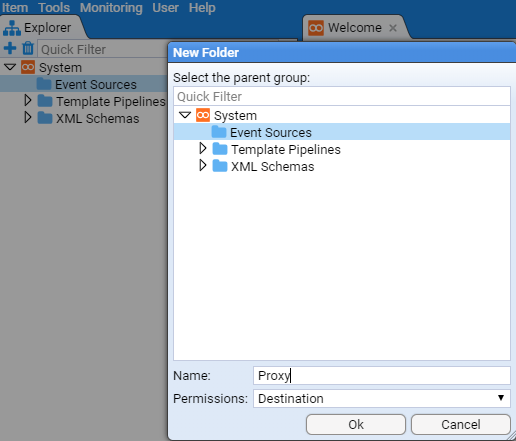

# Stroom HOWTO - Feed Management
This HOWTO demonstrates how to manage
[Feeds](../../user-guide/feeds.md "Stroom Feeds")

## Assumptions
- All Sections
 - an account with the `Administrator` Application [Permission](../../user-guide/roles.md "Stroom Application Permissions") is currently logged in.

## Creation of an Event Feed
We will be creating an Event Feed with the name `TEST-FEED-V1_0`.

Once you have logged in, move the cursor to the **System** folder within the `Explorer` tab and select it.

Once selected, _right click_ to bring up the `New Item` selection sub-menu. By selecting the **System** folder we are
requesting any  _new_ item created to be placed within it.

Now move the cursor to the _Feed_ sub-item

and select it. You will be presented with a `New Feed` configuration window.

You will note that the **System** folder has already been selected as the _parent group_ and all we need to do is enter our feed's name in the **Name:** entry box

On pressing

we are presented with the `Feed` tab for our new feed. The tab is labelled with the feed name `TEST-FEED-V1_0`.

.

We will leave the definitions of the Feed attributes for the present, but we _will_ enter a **Description:** for our feed
as we should _ALWAYS_ do this fundamental tenet of data management - document the data. We will use
the description of '_Feed for installation validation only. No data value_'.

.

One should note that the `Feed` tab as been marked as having unsaved changes. This is indicated by the asterisk
character `*` between the _Feed_ icon  and the name of the feed `TEST-FEED-V1_0`.
We can save the changes to our feed by pressing the _Save_ icon  in
the top left of the `TEST-FEED-V1_0` tab. At this point one should notice two things, the first is that the asterisk
has disappeared from the `Feed` tab and the _Save_ icon  is _ghosted_.

.

## 3. Folder Structure for Event Sources
In order to simplify the management of multiple event sources being processed by Stroom, it is suggested that an Event Source folder is created at the root of the **System** folder in the `Explorer` tab.

This can be achived by moving the cursor to the **System** folder within the `Explorer` tabe and select it. Once selected, _right click_ to bring up the `New Item` selection sub-menu.

Now move the cursor to the _Folder_ sub-item

and select it. You will be presented with a `New Folder` configuration window.

You will note that the **System** folder has already been selected as the _parent group_ and all we need to do is enter our folders's name in the **Name:** entry box

On pressing

we are presented with the `Folder` tab for our new folder. The tab is labelled with the folder name `Event Sources`.

.

You will also note that the `Explorer` tab has displayed the **Event Sources** folder in its display.

### Create Folder for specific Event Source
In order to manage all artefacts of a given Event Source (aka `Feed`), one would create an appropriately named sub-folder within the **Event Sources** folder structure.

In this example, we will create one for a BlueCoat Proxy `Feed`.

As we may eventually have multiple proxy event sources, we will first create a **Proxy** folder in the **Event Sources** before creating the desired **BlueCoat** folder that will hold the processing components.

So, move the cusor to the **Event Sources** folder on the `Explorer` tab, select it and then _right click_ to bring up the `New Item` selection sub-menu and move the cursor to the _Folder_ sub-item

and select it. You will be presented with a `New Folder` configuration window.

Enter **Proxy** as the folder **Name:**

and press the .

At this you will be presented with a new `Folder` tab for the new sub-folder and we note that it has been added below the **Event Sources** folder in the `Explorer` tab

.

Repeat this process to create the desired **BlueCoat** sub-folder with the result

.
