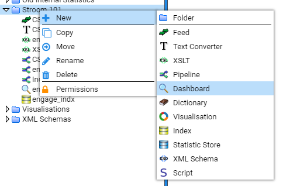
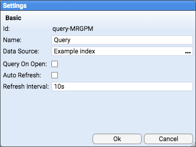
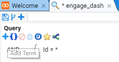
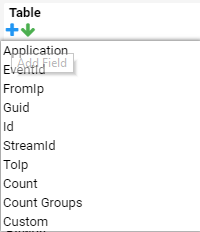
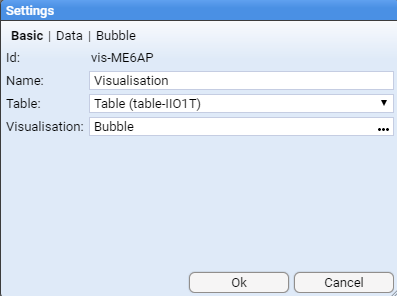

Create a new dashboard the same way you create anything else



On the query pane click the settings () button on the top right of the panel.

Choose the index you just created as your data source.



Now add a term to the query to get a handle on the data



For our simple example we’re using a wildcard that captures all documents with an Id set.


Within the table panel we now need to set a few defaults.  On the table pane click the settings () button on the top right of the panel.  `Extract Values` needs to be ticked.  If grouping is to be used and the content of the groups is to be viewed then `Show Group Detail` should also be ticked.  The `Maximum Results` field may also be changed from default if required to limit the results or if more results are expected than the default value.  Be aware that setting this value too high may result in excessive memory being used by the query process though.

We now need to select a pipeline to display the results in the table by setting `Extraction Pipeline`.  The simplest way is to create and save a new pipeline based on the existing `Search Extraction` template pipeline.  Within this new pipeline, use either the XSLT used for indexing the data or preferably a copy of this XSLT saved elsewhere.  The extraction pipeline and the dashboard itself should then be saved.

In the table panel we can add the fields we are interested in, in this case we wanted to sort the application field and count how many time the application name appears.



If at this point, we decide that we'd like to see additional fields in the table extracted from each record then the Extraction Pipeline XSLT can be modified to extract them from the Event:

```xml
...
<xsl:template match="/xpath/to/usefulField">
  <data name="UsefulField">
    <xsl:attribute name="value" select="text()" />
  </data>
</xsl:template>
...
```

To be able to select this new field from the table drop-down, it needs to be added back into the list of fields in the original index:

| Name         | Type   | Store  | Index  | Positions  | Analyser       | Case Sensitive
| ----         | ----   | -----  | -----  | ---------  | --------       | --------------
| UsefulField  | Text   | No     | No     | No         | Keyword        | false

If any additionals are made at this point, the index must first be saved and then the dashboard closed and reopened. `UsefulField` will then be available as a drop-down option in the table.

Start the query and we should get this


Then we can add an element from the top again and this time use visualisation


In the visualisation panel that has been added to the bottom, click the settings () button on the top right of the panel.

In our example we have used the Bubble visualisation




Which gives us this visualisation when the query is executed


Where you can hover over elements and get a summary of that representation.


