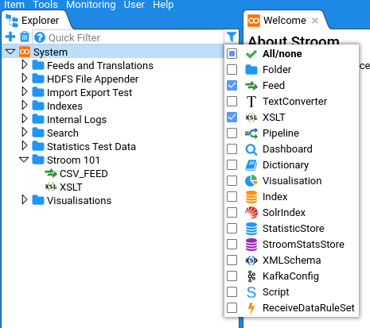
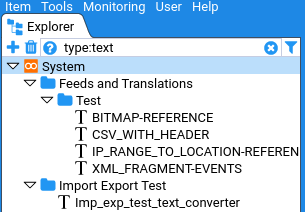

> * Version Information: Created with Stroom v7.0  
* Last Updated: 01 Jun 2020  

# Finding Things

This section describes how to find things in Stroom, for example content, simple string values, etc.

## Explorer Tree


The _Explorer Tree_ in stroom is the primary means of finding user created content, for example _Feeds_, _XSLTs_, _Pipelines_, etc.

Branches of the _Explorer Tree_ can be expanded and collapsed to reveal/hide the content at different levels.

### Filtering by Type

The _Explorer Tree_ can be filtered by the type of content, e.g. to display only _Feeds_, or only _Feeds_ and _XSLTs_.
This is done by clicking the filter icon </img>.
The following is an example of filtering by _Feeds_ and _XSLTs_.



Clicking _All/None_ toggles between all types selected and no types selected.

Filtering by type can also be achieved using the Quick Filter by entering the type name (or a partial form of the type name), prefixed with `type:`.
I.e:

```
type:feed
```

For example:



> NOTE: If both the type picker and the Quick Filter are used to filter on type then the two filters will be combined as an AND.


### Filtering by Name

The _Explorer Tree_ can be filtered by the name of the entity. 
This is done by entering some text in the _Quick Filter_ field.
The tree will then be updated to only show entities matching the _Quick Filter_.
The way the matching works for entity names is described in [Common Fuzzy Matching](#common-fuzzy-matching)

### Filtering by UUID

#### What is a UUID?

The _Explorer Tree_ can be filtered by the UUID of the entity.
The UUID [Universally unique identifier](https://en.wikipedia.org/wiki/Universally_unique_identifier) is an identifier that can be relied on to be unique both within the system and universally across all other systems.
Stroom uses UUIDs as the primary identifier for all content (Feeds, XSLTs, Pipelines, etc.) created in Stroom.
An entity's UUID is generated randomly by Stroom upon creation and is fixed for the life of that entity.

When an entity is exported it is exported with its UUID and if it is then imported into another instance of Stroom the same UUID will be used.
The name of an entity can be changed within Stroom but its UUID remains un-changed.

With the exception of _Feeds_, Stroom allows multiple entities to have the same name.
This is because entities may exist that a user does not have access to see so restricting their choice of names based on existing invisible entities would be confusing.
Where there are multiple entities with the same name the UUID can be used to distinguish between them.

The UUID of an entity can be viewed using the context menu for the entity.
The context menu is accessed by right-clicking on the entity.


Clicking _Info_ displays the entities UUID.


The UUID can be copied by selecting it and then pressing `ctrl-c`.

#### UUID Quick Filter Matching

In the _Explorer Tree_ _Quick Filter_ you can filter by UUIDs in the following ways:

To show the entity matching a UUID, enter the full UUID value (with dashes) prefixed with the field qualifier `uuid`, e.g. `uuid:a95e5c59-2a3a-4f14-9b26-2911c6043028`.

To filter on part of a UUID you can do `uuid:/2a3a` to find an entity whose UUID contains `2a3a` or `uuid:^2a3a` to find an entity whose UUID starts with `2a3a`.


## Quick Filters

Quick Filter controls are used in a number of screens in _Stroom_.
The most prominent use of a Quick Filter is in the Explorer Tree as described above.
Quick filters allow for quick searching of a data set or a list of items using a text based query language.
The basis of the query language is described in [Common Fuzzy Matching](#common-fuzzy-matching).

A number of the Quick Filters are used for filter tables of data that have a number of fields.
The quick filter query language supports matching in specified fields.
Each Quick Filter will have a number of named fields that it can filter on. 
The field to match on is specified by prefixing the match term with the name of the field followed by a `:`, i.e. `type:`.
Multiple field matches can be used, each separate by a space.
E.g:

```
name:^xml name:events$ type:feed
```
In the above example the filter will match on items with a name beginning `xml`, a name ending `events` and a type partially matching `feed`.

All the match terms are combined together with an AND operator.
The same field can be used multiple times in the match.
The list of filterable fields and their qualifier names (sometimes a shortened form) are listed by clicking on the help icon </img>.

One or more of the fields will be defined as _default_ fields.
This means the if no qualifier is entered the match will be applied to all _default_ fields using an OR operator.
Sometimes all fields may be considered _default_ which means a match term will be tested against all fields and an item will be included in the results if one or more of those fields match.

For example if the Quick Filter has fields `Name`, `Type` and `Status`, of which `Name` and `Type` are _default_:

```
feed status:ok
```

The above would match items with the Name OR Type fields match `feed` AND the Status field matches `ok`.

### Match Negation

Each match item can be negated using the `!` prefix.
This is also described in [Common Fuzzy Matching](#common-fuzzy-matching).
The prefix is applied after the field qualifier.
E.g:

```
name:xml source:!/default
```
In the above example it would match on items where the Name field matched `xml` and the Source field does NOT match the regex pattern `default`.

### Spaces and Quotes

If your match term contains a space then you can surround the match term with double quotes.
Also if your match term contains a double quote you can escape it with a `\` character.
The following would be valid for example.

```
"name:csv splitter" "default field match" "symbol:\""
```


## Quick Filters

Quick Filter controls are used in a number of screens in _Stroom_.
The most prominent use of a Quick Filter is in the Explorer Tree as described above.
Quick filters allow for quick searching of a data set or a list of items using a text based query language.
The basis of the query language is described in [Common Fuzzy Matching](#common-fuzzy-matching).

A number of the Quick Filters are used for filter tables of data that have a number of fields.
The quick filter query language supports matching in specified fields.
Each Quick Filter will have a number of named fields that it can filter on. 
The field to match on is specified by prefixing the match term with the name of the field followed by a `:`, i.e. `type:`.
Multiple field matches can be used, each separate by a space.
E.g:

```
name:^xml name:events$ type:feed
```
In the above example the filter will match on items with a name beginning `xml`, a name ending `events` and a type partially matching `feed`.

All the match terms are combined together with an AND operator.
The same field can be used multiple times in the match.
The list of filterable fields and their qualifier names (sometimes a shortened form) are listed by clicking on the help icon </img>.

One or more of the fields will be defined as _default_ fields.
This means the if no qualifier is entered the match will be applied to all _default_ fields using an OR operator.
Sometimes all fields may be considered _default_ which means a match term will be tested against all fields and an item will be included in the results if one or more of those fields match.

For example if the Quick Filter has fields `Name`, `Type` and `Status`, of which `Name` and `Type` are _default_:

```
feed status:ok
```

The above would match items with the Name OR Type fields match `feed` AND the Status field matches `ok`.

### Match Negation

Each match item can be negated using the `!` prefix.
This is also described in [Common Fuzzy Matching](#common-fuzzy-matching).
The prefix is applied after the field qualifier.
E.g:

```
name:xml source:!/default
```
In the above example it would match on items where the Name field matched `xml` and the Source field does NOT match the regex pattern `default`.

### Spaces and Quotes

If your match term contains a space then you can surround the match term with double quotes.
Also if your match term contains a double quote you can escape it with a `\` character.
The following would be valid for example.

```
"name:csv splitter" "default field match" "symbol:\""
```


## Suggestion Input Fields

Stroom uses a number of suggestion input fields, such as when selecting Feeds, Pipelines, types, status values, etc. in the pipeline processor filter screen.


These fields will typically display the full list of values or a truncated list where the total number of value is too large.
Entering text in one of these fields will use the fuzzy matching algorithm to partially/fully match on values.
See [CommonFuzzy Matching](#common-fuzzy-matching) below for details of how the matching works.


## Common Fuzzy Matching

A common fuzzy matching mechanism is used in a number of places in _Stroom_.
It is used for partially matching the user input to a list of a list of possible values.

In some instances, the list of matched items will be truncated to a more manageable size with the expectation that the filter will be refined.

The fuzzy matching employs a number of approaches that are attempted in the following order:

NOTE: In the following examples the `^` character is used to indicate which characters have been matched.


### No Input

If no input is provided all items will match.

### Word Boundary Matching

If the user input is prefixed with a `?` character then word boundary matching will be employed.
This approaches uses upper case letters to denote the start of a word.
If you know all the words in the item you are looking for then condensing those words down to their first letters (capitalised) makes this a more targeted way to find what you want than the characters anywhere matching above.
Words can either be separated by characters like `_- ()[]`, or be distinguished with `lowerCamelCase` or `upperCamelCase` format.
An upper case letter in the input denotes the beginning of a 'word' and any subsequent lower case characters are treated as contiguously following the character at the start of the word.

**User input**: `?OTheiMa`

**Will match**: 

```
the cat sat on their mat
            ^  ^^^^  ^^                                                                  
ON THEIR MAT
^  ^^^^  ^^ 
Of their magic
^  ^^^^  ^^   
o thei ma
^ ^^^^ ^^
onTheirMat
^ ^^^^ ^^ 
OnTheirMat
^ ^^^^ ^^ 
```


**Won't match**: `On the mat`, `the cat sat on there mat`, `On their moat`


**User input**: `?MFN`

**Will match**: 

```
MY_FEED_NAME
^  ^    ^   
MY FEED NAME
^  ^    ^   
THIS_IS_MY_FEED_NAME_TOO
        ^  ^    ^                  
myFeedName
^ ^   ^   
MyFeedName
^ ^   ^   
my-feed-name
^  ^    ^   
MFN
^^^
```

**Won't match**: `myfeedname`, `NOT MY FEED NAME`


### Regular Expression Matching

If the user input is prefixed with a `/` character then the remaining user input is treated as a Java syntax regular expression.
An string will be considered a match if any part of it matches the regular expression pattern.
The regular expression operates in case insensitive mode.

**User input**: `/(^|wo)man`

**Will match**: 
```
MAN
^^^
A WOMAN
  ^^^^^
Manly
^^^  
Womanly
^^^^^  
```

**Won't match**: `A MAN`, `HUMAN`


### Exact Match

If the user input is prefixed with a `^` character and suffixed with a `$` character then a case-insensitive exact match will be used.
E.g:

**User input**: `^xml-events$`

**Will match**: 

```
xml-events
^^^^^^^^^^
XML-EVENTS
^^^^^^^^^^
```

**Won't match**: `xslt-events`, `XML EVENTS`, `SOME-XML-EVENTS`, `AN-XML-EVENTS-PIPELINE`

Note: Despite the similarity in syntax, this is NOT regular expression matching.


### Starts With

If the user input is prefixed with a `^` character then a case-insensitive starts with match will be used.
E.g:

**User input**: `^events`

**Will match**: 

```
events
^^^^^^
EVENTS_FEED
^^^^^^     
events-xslt
^^^^^^     
```

**Won't match**: `xslt-events`, `JSON_EVENTS`

Note: Despite the similarity in syntax, this is NOT regular expression matching.

### Ends With


If the user input is suffixed with a `$` character then a case-insensitive ends with match will be used.
E.g:

**User input**: `events$`

**Will match**:

```
events
^^^^^^
xslt-events
     ^^^^^^
JSON_EVENTS
     ^^^^^^
```

**Won't match**: `EVENTS_FEED`, `events-xslt`

Note: Despite the similarity in syntax, this is NOT regular expression matching.


### Wild-Carded Case Sensitive Exact Matching

If one or more `*` characters are found in the user input then this form of matching will be used.

This form of matching is to support those fields that accept wild-carded values, e.g. a whild-carded feed name expression term.
In this instance you are NOT picking a value from the suggestion list but entering a wild-carded value that will be evaluated when the expression/filter is actually used.
The user may want an expression term that matches on all feeds starting with `XML_`, in which case they would enter `XML_*`.
To give an indication of what it would match on if the list of feeds remains the same, the list of suggested items will reflect the wild-carded input.

**User input**: `XML_*`

**Will match**:

```
XML_
^^^^
XML_EVENTS
^^^^          
```

**Won't match**: `BAD_XML_EVENTS`, `XML-EVENTS`, `xml_events`

**User input**: `XML_*EVENTS*`

**Will match**:

```
XML_EVENTS
^^^^^^^^^^
XML_SEC_EVENTS
^^^^    ^^^^^^
XML_SEC_EVENTS_FEED
^^^^    ^^^^^^
```

**Won't match**: `BAD_XML_EVENTS`, `xml_events`


### Characters Anywhere Matching

If no prefixes or suffixes are used then all characters in the user input will need to appear in the matched item in the order input.
The matching is case insensitive.

**User input**: `bad`

**Will match**:

```
Big Angry Dog
^   ^     ^  
bad angry dog
^^^          
BAD
^^^
badly
^^^  
Very bad
     ^^^
b a d
^ ^ ^
bbaadd
^ ^ ^ 
```

**Won't match**: `dab`, `ba`

### Match Negation

A match can be negated, ie. the NOT operator using the prefix `!`.
This prefix can be applied *before* all the match prefixes listed above.
E.g:

```
!/(error|warn)
```
In the above example it will match everything except those matched by the regex pattern `(error|warn)`.
